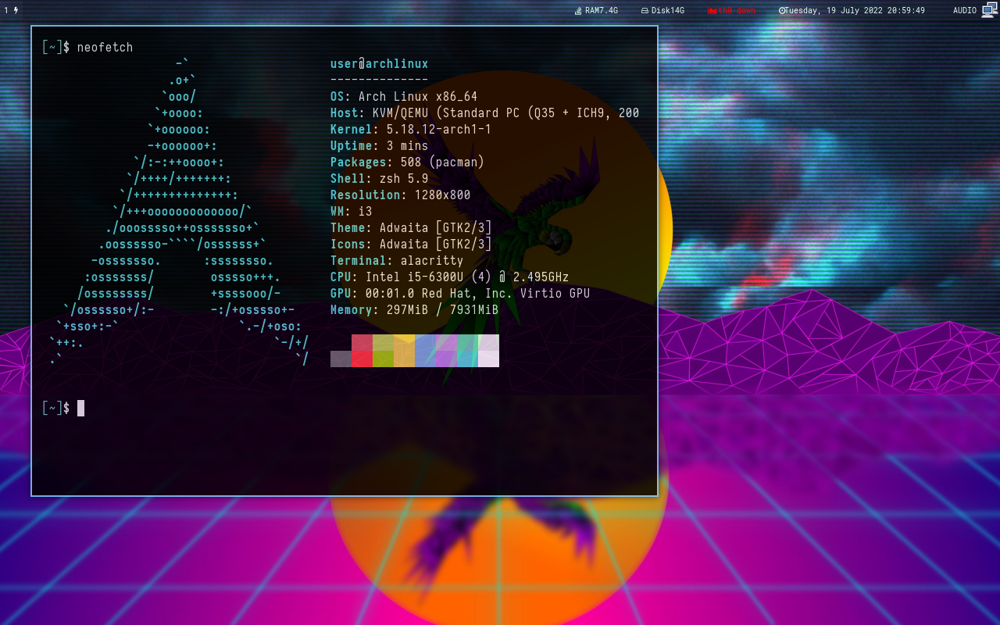

# Documentation

My config files for:
- alacritty
- compton (depracated)
- i3
  - i3wm
  - i3block
- rofi
- zsh
- dunst

## Startup script

Running programs on start was moved from i3 config, to traditional script. 
Right now script located at ```script/startup_script.sh``` is used to launch
programs.

This was made, to make configuration files more i3 independent.

## TODOS

- Make this documentation readeable and production ready.
- Add help
- Nicer Rice

## Note

- I'm creating symlink to ```~/.config``` from this repo.
